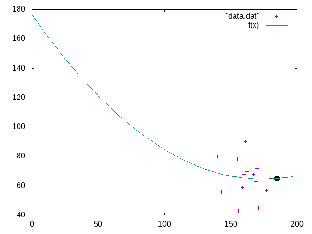

# Least Squares Quadratic Curve Fitting in C

The C program solves the standard least squares equation using Gauss-Jordan Elimination by getting the reduced row echelon form.

Test data has one feature and one label. It is inserted in runner.c as well as data.dat. Plots are generated using gnuplot and the script can be found in script.plt. The file 'LeastSquares.m' is a MATLAB implementation of the same idea. 

*The sample data is a quadratic fit, but the code can be slightly modified to fit any standard predefined equation.*

## Instructions

To execute the program as it is:

```bash
gcc runner.c -o runner
./runner
```

If you want to plot the equation:

```sh
gnuplot script.plt
```

(Obviously, you'll need gnuplot for this)

## Sample Data

$$
w = ah^2 + bh + c
$$

where w is the weight and h is the height. 

| Serial No | Height in cm | Weight in kg |
| --------- | ------------ | ------------ |
| 1         | 160          | 68           |
| 2         | 155          | 78           |
| 3         | 143          | 56           |
| 4         | 162          | 70           |
| 5         | 170          | 72           |
| 6         | 175          | 78           |
| 7         | 167          | 68           |
| 8         | 163          | 54           |
| 9         | 156          | 43           |
| 10        | 172          | 71           |
| 11        | 180          | 65           |
| 12        | 159          | 59           |
| 13        | 169          | 63           |
| 14        | 157          | 62           |
| 15        | 161          | 90           |
| 16        | 171          | 45           |
| 17        | 181          | 62           |
| 18        | 177          | 57           |
| 19        | 140          | 80           |

## Result

We get: a = 0.003703, b = -1.288406, c = 176.578090

Plot:

(The black dot shows the weight corresponding to predicted weight at 185 cm height)


